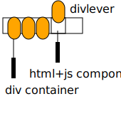

# divlever



A lightweight framework for building modular, component-based web apps using div containers.

## Build your first divlever app

- copy divlever.js and the LICENSE file into your project's lib directory

index.html

```html
<!DOCTYPE html>
<html>
  <head>
    <script src="lib/divlever.js"></script>
    <script src="components.js"></script>
  </head>
  <body>
    <div id="myComponent-1"></div>
    <div id="myPageContainerComponent-1" src="subpage.html"></div>
  </body>
</html>
```

components.js

```js
divlever.udfs.mySubComponent = function(cmd, payload, n) {
    divlever.render(`world`);
};
divlever.udfs.myComponent = function(cmd, payload, n) {
    var subN = n;
    divlever.render(`hello, <div id="mySubComponent-${subN}"></div>`);
};
```

subpage.html

```html
<div id="myComponent-2"></div> from fetched subpage.
```

### Running the server

Run this in your project folder (where `index.html` is located)

```
python3 -m http.server
# open localhost:8000/index.html in browser
```

